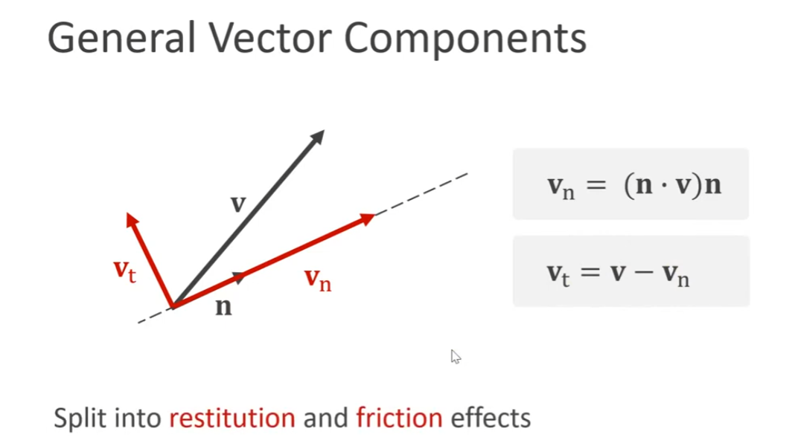
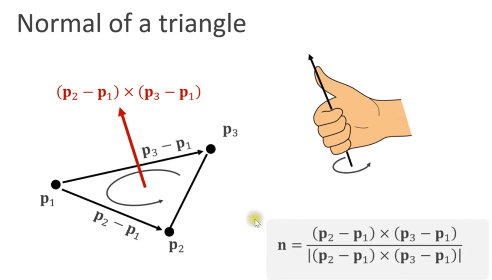
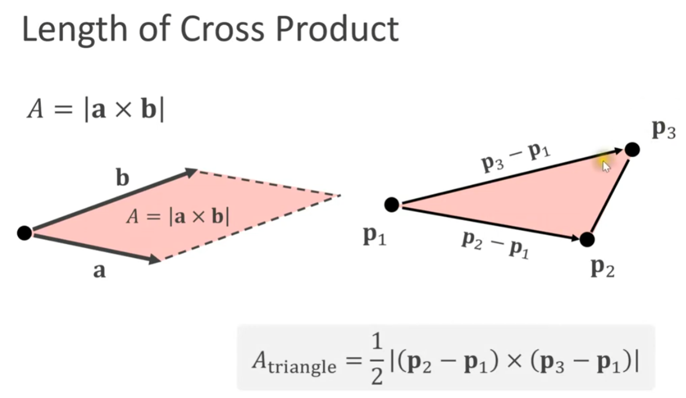
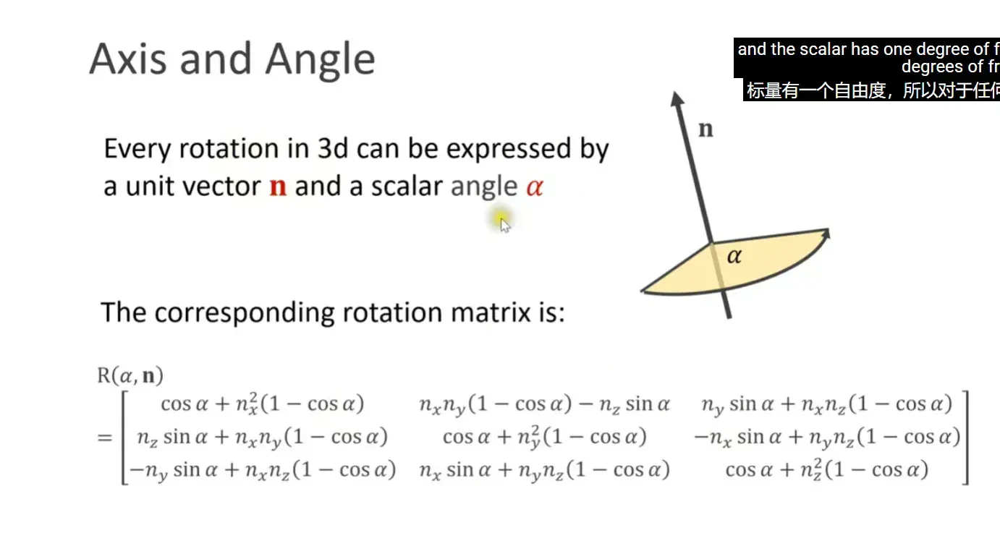
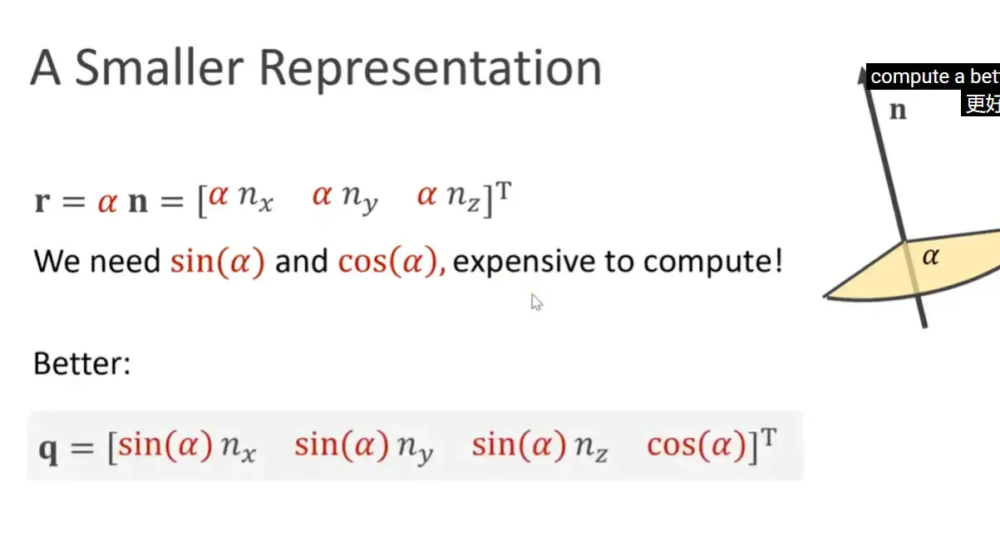

# 📐 3D 仿真向量数学直观指南 
### Intuitive 3D Vector Math for Simulation

**👨‍🏫 讲师:** Matthias Müller (Ten Minute Physics)  
**🎯 核心目标:** 介绍编写 3D 仿真代码所需的数学核心概念，不仅包含定义，更侧重于物理直观理解。

---

## 📚 目录导航

| 章节 | 内容 | 要点 |
|------|------|------|
| [🌐 1. 坐标系](#1-坐标系-coordinate-systems) | 数学与图形学差异 | Y-up vs Z-up |
| [➕ 2. 基础向量运算](#2-基础向量运算-basic-operations) | 加减乘除、归一化 | 物理仿真基础 |
| [⚡ 3. 点积与叉积](#3-两个核心运算-dot--cross-product) | 核心运算 | 投影、法线、面积 |
| [🔄 4. 矩阵与变换](#4-矩阵与变换-matrices--transformations) | 线性变换、仿射变换 | 四面体蒙皮 |
| [🎯 5. 刚体变换](#5-刚体变换-rigid-transforms) | 旋转矩阵特性 | R⁻¹ = Rᵀ |
| [🔮 6. 旋转表示](#6-旋转表示从轴角到四元数) | 轴角到四元数 | 无万向锁 |
| [⚙️ 性能优化](#性能优化建议) | SIMD、缓存策略 | 实战技巧 |
| [📖 附录](#附录常用常量) | 常量定义 | 快速参考 |

---

## 1. 坐标系 (Coordinate Systems) 

[🔝 回到顶部](#-目录导航)

### 1.1 数学与图形学的差异 🔄

**✋ 右手坐标系 (Right-handed System):**
- 👍 拇指 = X轴（红色）
- 👆 食指 = Y轴（绿色）
- 🤏 中指 = Z轴（蓝色）

```cpp
// 右手坐标系定义
struct CoordinateSystem {
    Vector3 x_axis;  // 👍 拇指方向
    Vector3 y_axis;  // 👆 食指方向  
    Vector3 z_axis;  // 🤏 中指方向
};
```

| 标准 | 向上轴 | 应用场景 | 记忆方法 | 图标 |
|------|--------|----------|----------|------|
| **数学标准** | Z轴向上 (Z-up) | 📊 学术论文 | X和Y在地面 | 📈 |
| **图形学标准** | **Y轴向上 (Y-up)** | 🎮 游戏引擎 | 屏幕Y向上，深度方向即为Z轴 | 🖼️ |

> ⚠️ **原因:** 屏幕本身是2D坐标系（X向右，Y向上），深度方向即为Z轴（指向屏幕外/摄像机）。这也解释了为什么深度缓冲被称为 Z-buffer。  
> ✅ **本教程采用图形学标准 (Y-up)**。

### 1.2 向量表示 📊

**定义:** 3个分量/坐标的组合。

**记法:**
- 📝 列向量 (Column form)：用方括号括起来的垂直排列数字
- 🔤 符号：粗体小写字母 (如 $\mathbf{v}$)

$$\mathbf{v} = \begin{bmatrix} v_x \\ v_y \\ v_z \end{bmatrix}$$

**两种用途:**
1. 📍 **位置 (Location):** 空间中的点 (如粒子位置 $\mathbf{p}$)
2. ➡️ **箭头 (Arrow):** 具有方向和大小的量 (如速度 $\mathbf{v}$)

```cpp
class Vector3 {
    float x, y, z;
    
    // 📍 语义1：表示空间中的点
    Vector3 position;
    
    // ➡️ 语义2：表示方向和大小
    Vector3 velocity;
};
```

---

## 2. 基础向量运算 (Basic Operations) 

[🔝 回到顶部](#-目录导航)

### 2.1 加法 (Addition) ➕

**🎯 用途:** 时间积分 (Move forward in time)。  
**📐 公式:** $\mathbf{p}_{new} = \mathbf{p} + \mathbf{a}$ (对应分量相加)。

$$\mathbf{p}_{new} = \mathbf{p} + \Delta t \cdot \mathbf{v}$$

```cpp
Vector3 UpdatePosition(const Vector3& pos, const Vector3& vel, float dt) {
    return pos + vel * dt;
}
```

### 2.2 缩放 (Scaling) ✖️

**🎯 用途:** 从速度计算位置更新量。  
**🔧 操作:** 向量 $\times$ 标量 (如 $\Delta t \mathbf{v}$)。  
**💡 特性:** 改变长度，**方向不变**。

```cpp
Vector3 Scale(const Vector3& v, float s) {
    return Vector3(v.x * s, v.y * s, v.z * s);
}
```

### 2.3 减法 (Subtraction) ➖

**🎯 用途:** 计算两点间的向量。  
**📐 公式:** 从 A 指向 B 的向量 = $\mathbf{b} - \mathbf{a}$。  
> ⚠️ *注意:* 是 **目标 - 起点** (Not A-B)。

```cpp
Vector3 GetDirection(const Vector3& from, const Vector3& to) {
    return to - from;  // ⚠️ 注意顺序！
}
```

### 2.4 长度 (Length) 📏

**📐 公式:** $|\mathbf{v}| = \sqrt{v_x^2 + v_y^2 + v_z^2}$ (毕达哥拉斯定理/勾股定理)。

```cpp
float Length(const Vector3& v) {
    return sqrt(v.x * v.x + v.y * v.y + v.z * v.z);
}
```

### 2.5 归一化 (Normalization) 🎯

**🔤 单位向量 (Unit Vector/Normal):** 长度为 1 的向量，通常用 $\mathbf{n}$ 表示。  
**📐 计算:** $\mathbf{n} = \mathbf{v} / |\mathbf{v}|$ (向量除以其长度)。

$$\mathbf{n} = \frac{\mathbf{v}}{|\mathbf{v}|}$$

```cpp
Vector3 Normalize(const Vector3& v) {
    float len = Length(v);
    if (len < EPSILON) return Vector3(0, 0, 0);  // ⚠️ 避免除零
    return v / len;
}
```

---

## 3. 两个核心运算 (Dot & Cross Product) 

[🔝 回到顶部](#-目录导航)

### 3.1 点积 (Dot Product) $\mathbf{a} \cdot \mathbf{b}$ 🔵

**📝 定义:** $a_x b_x + a_y b_y + a_z b_z$。  
**📊 结果:** **标量 (Scalar)** (这也是它叫标量积的原因)。

$$\mathbf{a} \cdot \mathbf{b} = a_x b_x + a_y b_y + a_z b_z = |\mathbf{a}||\mathbf{b}|\cos\theta$$

```cpp
float Dot(const Vector3& a, const Vector3& b) {
    return a.x * b.x + a.y * b.y + a.z * b.z;
}
```

**🎯 核心用途:**

#### 1️⃣ 投影长度
计算向量 $\mathbf{v}$ 在单位向量 $\mathbf{n}$ 方向上的长度 ($len = \mathbf{v} \cdot \mathbf{n}$)。

<div align="center">
    
</div>

```
📐 推导过程:
1. [几何定义] 投影长度 = |v| * cos(θ)                     
2. [点积定义] v·n = |v| * |n| * cos(θ)                   
3. [代入消去] 投影长度 = (v·n) / |n|                    
4. [归一化] 单位向量 = n / |n|                         
5. [最终公式] 投影向量 = 投影长度 * 单位向量
            = (v·n) / |n| * n / |n|
            = (v·n) / |n|² * n                 
```

```cpp
// 📐 计算v在单位向量n上的投影
Vector3 Project(const Vector3& v, const Vector3& n) {
    float projection_length = Dot(v, n);
    return n * projection_length;
}

// 🔀 分解为法向和切向分量
void Decompose(const Vector3& v, const Vector3& n,
                Vector3& v_normal, Vector3& v_tangent) {
    v_normal = Project(v, n);
    v_tangent = v - v_normal;
}
```

#### 2️⃣ 垂直检测
如果 $\mathbf{a} \cdot \mathbf{b} = 0$，则两向量互相**垂直** ⊥。

```cpp
bool IsPerpendicular(const Vector3& a, const Vector3& b) {
    return fabs(Dot(a, b)) < EPSILON;
}
```

#### 3️⃣ 分解应用
将向量分解为切向分量和法向分量（用于处理摩擦力和恢复力）。

### 3.2 叉积 (Cross Product) $\mathbf{a} \times \mathbf{b}$ ❌

**📊 结果:** **向量 (Vector)**。  
**🎯 几何意义:** 生成一个同时垂直于 $\mathbf{a}$ 和 $\mathbf{b}$ 的新向量。遵循右手定则。

$$\mathbf{a} \times \mathbf{b} = \begin{bmatrix} 
a_y b_z - a_z b_y \\
a_z b_x - a_x b_z \\
a_x b_y - a_y b_x
\end{bmatrix}$$

```cpp
Vector3 Cross(const Vector3& a, const Vector3& b) {
    return Vector3(
        a.y * b.z - a.z * b.y,
        a.z * b.x - a.x * b.z,
        a.x * b.y - a.y * b.x
    );
}
```

**🎯 核心用途:**

#### 1️⃣ 三角形法线
$(\mathbf{p}_2 - \mathbf{p}_1) \times (\mathbf{p}_3 - \mathbf{p}_1)$

##### 🔄 逆时针约定（CCW - Counter-Clockwise）
这是图形学中最常见的约定：
- 👁️ **从法向量方向看**，顶点按逆时针排列
- ✋ **右手定则**：手指沿 p1→p2→p3 弯曲，拇指指向法向
- 🎮 **引擎默认**：UE和Unity都使用CCW作为"正面"

<div align="center">
    
</div>

```cpp
Vector3 TriangleNormal(const Vector3& p1, const Vector3& p2, const Vector3& p3) {
    Vector3 edge1 = p2 - p1;
    Vector3 edge2 = p3 - p1;
    return Normalize(Cross(edge1, edge2));
}
```

#### 2️⃣ 三角形面积
Area = $\frac{1}{2} |\mathbf{a} \times \mathbf{b}|$ (叉积结果的长度是平行四边形面积)。

<div align="center">
    
</div>

$$\text{Area} = \frac{1}{2}|\mathbf{a} \times \mathbf{b}|$$

```cpp
float TriangleArea(const Vector3& p1, const Vector3& p2, const Vector3& p3) {
    Vector3 edge1 = p2 - p1;
    Vector3 edge2 = p3 - p1;
    return 0.5f * Length(Cross(edge1, edge2));
}
```

#### 3️⃣ 四面体体积
Volume = $\frac{1}{6} (\mathbf{a} \times \mathbf{b}) \cdot \mathbf{c}$ (混合积)。

<div align="center">
    
</div>

$$\text{Volume} = \frac{1}{6}|(\mathbf{a} \times \mathbf{b}) \cdot \mathbf{c}|$$

```cpp
float TetrahedronVolume(const Vector3& a, const Vector3& b, const Vector3& c) {
    return fabs(Dot(Cross(a, b), c)) / 6.0f;
}
```

---

## 4. 矩阵与变换 (Matrices & Transformations) 

[🔝 回到顶部](#-目录导航)

### 4.1 $3\times3$ 矩阵 📊

**🔤 记法:** 大写字母 (如 $A$)。  
**💡 直观理解 (关键点):**
- 矩阵乘法 $\mathbf{Ax}$ 可以理解为：矩阵的**列向量 (Columns)** 是变换后的**新坐标轴**
- $\mathbf{Ax} = x_1 \mathbf{a}_1 + x_2 \mathbf{a}_2 + x_3 \mathbf{a}_3$
- 如果列向量长度 $>1$，则拉伸 📈；$<1$，则压缩 📉

$$\mathbf{A} = \begin{bmatrix} 
\mathbf{a}_1 & \mathbf{a}_2 & \mathbf{a}_3 
\end{bmatrix}$$

```cpp
struct Matrix3x3 {
    Vector3 col[3];  // 列向量
    
    Vector3 Transform(const Vector3& v) const {
        return col[0] * v.x + col[1] * v.y + col[2] * v.z;
    }
};
```

### 4.2 仿射变换 (Affine Transformation) 🔄

**📐 公式:** $\mathbf{v}' = A\mathbf{v} + \mathbf{b}$
- $A$: 线性变换 (旋转、缩放、切变)
- $\mathbf{b}$: 平移 (Translation/Offset)，即新坐标系的原点

```cpp
struct AffineTransform {
    Matrix3x3 A;  // 🔄 线性部分（旋转/缩放/切变）
    Vector3 b;    // ➡️ 平移部分
    
    Vector3 Transform(const Vector3& v) const {
        return A.Transform(v) + b;
    }
};
```

### 4.3 行列式 (Determinant) 📊

**🎯 物理意义:** 体积缩放因子。
- $\det(A) = 1$: 体积守恒 (如纯旋转) ♻️
- $\det(A) = 0$: 体积塌缩 (所有轴共面，变换不可逆) ⚠️
- 几何上，它是由矩阵列向量构成的平行六面体的体积

| det(A) | 物理意义 | 示例 | 图标 |
|--------|----------|------|------|
| = 1 | 体积守恒 | 纯旋转 | ♻️ |
| > 1 | 体积放大 | 均匀缩放 | 📈 |
| < 0 | 镜像翻转 | 反射变换 | 🔄 |
| = 0 | 体积塌缩 | 投影到平面 | ⚠️ |

### 4.4 矩阵组合与逆矩阵 🔗

**组合:** $C = BA$ (先应用 A，再应用 B)。  
**逆矩阵 ($A^{-1}$):** 逆向变换，回到原点。$\mathbf{x} = A^{-1}(A\mathbf{x})$。

**🎯 应用 - 四面体蒙皮 (Tetrahedral Skinning):**

<div align="center">
    
</div>

### 🔍 四面体蒙皮详解

**🎯 核心目标**

我们有一个物体（比如角色模型的顶点），它嵌入在一个四面体（作为"骨骼"或"控制体"）内部。当这个控制四面体发生任意变形（旋转、缩放、平移、拉伸）时，我们希望嵌入其中的点 x 能自动、平滑地变换到新位置 x'，仿佛被四面体"带着走"一样。这个过程就是"蒙皮"。

**🔄 转换的两个阶段**

图中的公式 `x' = P Q⁻¹ x + (p - P Q⁻¹ q)` 完美地描述了这个过程。我们可以将其理解为两个连续的步骤：

#### 步骤1️⃣：将点 x 从世界坐标映射到四面体的局部坐标（`Q⁻¹ x`）

1. **构建局部坐标系（矩阵 Q）：**
   - 看图左上角的初始四面体。我们以其中一个顶点（例如 q₀）为原点，构建一个局部坐标系
   - 这个坐标系的三个轴由从 q₀ 出发到另外三个顶点的向量定义：q₁ - q₀, q₂ - q₀, q₃ - q₀
   - 矩阵 Q 就是由这三个向量作为列向量构成的 3x3 矩阵。Q 定义了初始四面体的"姿态"和"形状"

2. **坐标变换（求逆）：**
   - 任何在四面体内部的点 x，都可以用这个局部坐标来表示，即 x = Q b + q₀，其中 b 是 x 在局部坐标系下的坐标
   - 为了得到 b，我们进行逆变换：b = Q⁻¹ (x - q₀)
   - 公式中的 `Q⁻¹ x` 部分其实是简化写法，其完整含义就是计算点 x 相对于四面体局部坐标系的"权重"或"相对位置" b
   - 💡 这一步的精髓在于，无论四面体如何变形，点 x 在它内部的这个"相对位置" `b` 是应该保持不变的

#### 步骤2️⃣：将点的局部坐标映射到变形后的世界坐标（`P b + p₀`）

1. **构建变形后的坐标系（矩阵 P）：**
   - 看图右上角变形后的四面体。同样，我们以新四面体的对应顶点 p₀ 为原点
   - 用新的边向量 p₁ - p₀, p₂ - p₀, p₃ - p₀ 构建新的矩阵 P
   - P 定义了变形后四面体的新"姿态"和"形状"

2. **应用变换：**
   - 现在，我们将第一步中计算得到的、保持不变的局部坐标 b，应用到这个新的坐标系 P 上。即 x' = P b + p₀
   - 因为 b = Q⁻¹ (x - q₀)，代入后得到：
     ```
     x' = P [Q⁻¹ (x - q₀)] + p₀
     x' = P Q⁻¹ x - P Q⁻¹ q₀ + p₀
     x' = P Q⁻¹ x + (p₀ - P Q⁻¹ q₀)
     ```

✅ 这正是图中最终的公式：x' = P Q⁻¹ x + (p - P Q⁻¹ q)。这里的 p 和 q 就对应我们例子中的 p₀ 和 q₀。

总而言之，四面体蒙皮的转换是一个巧妙的仿射变换。它通过"世界坐标 ➡️ 局部坐标 ➡️ 新的世界坐标"这两步映射，确保了点与其嵌入的四面体之间的相对关系在变形过程中保持不变，从而实现逼真、平滑的几何体变形。

通过逆矩阵将世界坐标点映射回四面体的局部坐标（重心坐标概念），用于随四面体变形驱动顶点运动。  
公式: $\mathbf{x}' = P Q^{-1} \mathbf{x} + (\mathbf{p} - P Q^{-1} \mathbf{q})$。

```cpp
class TetrahedralSkinning {
    Matrix3x3 Q;     // 原始四面体的边向量矩阵
    Matrix3x3 Q_inv; // Q的逆矩阵
    Vector3 q;       // 原始四面体的参考点
    
    Vector3 Deform(const Vector3& x, 
                   const Matrix3x3& P, 
                   const Vector3& p) const {
        // 步骤1: 计算局部坐标
        Vector3 local = Q_inv * x;
        
        // 步骤2: 应用新变换
        return P * local + (p - P * Q_inv * q);
    }
};
```

---

## 5. 刚体变换 (Rigid Transforms) 

[🔝 回到顶部](#-目录导航)

### 5.1 定义 📐

✅ 仅包含**平移**和**旋转**。  
❌ 没有缩放或切变。

### 5.2 特性 🌟

旋转矩阵的列向量：
1. 📏 长度为 1 (单位向量)
2. ⊥ 互相垂直 (点积为 0)

**⚡ 重要性质:** 对于旋转矩阵 $R$，其逆矩阵等于其转置矩阵。
- **$R^{-1} = R^T$** 
- 💡 *意义:* 计算转置比计算逆矩阵快得多，这就是刚体仿真高效的原因！

```cpp
class RotationMatrix {
    Matrix3x3 R;
    
    // ⚡ 求逆非常高效 - 只需转置！
    Matrix3x3 GetInverse() const {
        return R.Transpose();  // O(1) 而不是 O(n³)
    }
    
    bool IsValid() const {
        // ✅ 检查是否为有效旋转矩阵
        // 1. 列向量是单位向量
        // 2. 列向量互相垂直
        // 3. 行列式 = 1
        return fabs(R.Determinant() - 1.0f) < EPSILON;
    }
};
```

### 5.3 转置 (Transpose) $A^T$ 🔄

行变列，列变行。  
**🔢 无点点积 (Dot-less Dot Product):** $\mathbf{a} \cdot \mathbf{b} = \mathbf{a}^T \mathbf{b}$ (矩阵乘法形式)。  
$\mathbf{a}^T \mathbf{a} = |\mathbf{a}|^2$ (长度的平方)。

```cpp
// 点积的矩阵形式
float DotProduct(const Vector3& a, const Vector3& b) {
    // 将a视为行向量，b视为列向量
    return a.Transpose() * b;
}
```

---

## 6. 旋转表示：从轴角到四元数 

[🔝 回到顶部](#-目录导航)

### 6.1 轴角表示法 (Axis-Angle) 🔄

<div align="center">
    
</div>

任何3D旋转都可以用单位向量 **n** 和标量角度 α 表示。

**🔢 Rodrigues旋转公式:**

$$\mathbf{R}(\alpha, \mathbf{n}) = \cos\alpha \mathbf{I} + (1-\cos\alpha)\mathbf{n}\mathbf{n}^T + \sin\alpha[\mathbf{n}]_{\times}$$

对应的旋转矩阵：

$$R(\alpha, \mathbf{n}) = \begin{bmatrix}
\cos\alpha + n_x^2(1-\cos\alpha) & n_xn_y(1-\cos\alpha) - n_z\sin\alpha & n_y\sin\alpha + n_xn_z(1-\cos\alpha) \\
n_z\sin\alpha + n_xn_y(1-\cos\alpha) & \cos\alpha + n_y^2(1-\cos\alpha) & -n_x\sin\alpha + n_yn_z(1-\cos\alpha) \\
-n_y\sin\alpha + n_xn_z(1-\cos\alpha) & n_x\sin\alpha + n_yn_z(1-\cos\alpha) & \cos\alpha + n_z^2(1-\cos\alpha)
\end{bmatrix}$$

```cpp
Matrix3x3 AxisAngleToMatrix(const Vector3& axis, float angle) {
    float c = cos(angle);
    float s = sin(angle);
    float t = 1 - c;
    
    Vector3 n = Normalize(axis);
    
    return Matrix3x3(
        c + n.x*n.x*t,     n.x*n.y*t - n.z*s, n.x*n.z*t + n.y*s,
        n.y*n.x*t + n.z*s, c + n.y*n.y*t,     n.y*n.z*t - n.x*s,
        n.z*n.x*t - n.y*s, n.z*n.y*t + n.x*s, c + n.z*n.z*t
    );
}
```

### 6.2 更小的表示法 📉

<div align="center">
    
</div>

**❌ 问题:** 轴角表示需要计算 sin(α) 和 cos(α)，计算成本高！

$$\mathbf{r} = \alpha \mathbf{n} = [\alpha n_x \quad \alpha n_y \quad \alpha n_z]^T$$

**✅ 更好的方案：四元数**

$$\mathbf{q} = [\sin(\alpha)n_x \quad \sin(\alpha)n_y \quad \sin(\alpha)n_z \quad \cos(\alpha)]^T$$

### 6.3 四元数 (Quaternions) 🔮

#### ❓ 为什么要用四元数？

- 矩阵存储 9 个值，对于仅有 3 个自由度的旋转来说太浪费 💾
- 轴角表示法 (Axis-Angle) 需要计算三角函数 ($\sin, \cos$)，计算成本高 ⚡
- 四元数只需 4 个值，计算旋转更高效 🚀

| 表示方法 | 存储 | 计算效率 | 问题 | 评级 |
|----------|------|----------|------|------|
| 旋转矩阵 | 9个值 | 一般 | 存储冗余 | ⭐⭐ |
| 欧拉角 | 3个值 | 差 | 万向锁 | ⭐ |
| 轴角 | 4个值 | 差 | 需要sin/cos | ⭐⭐ |
| **四元数** | **4个值** | **优秀** | **最优选择** | ⭐⭐⭐⭐⭐ |

#### 📝 定义

由一个向量部分和一个标量部分组成：$\mathbf{q} = [x, y, z, w]$。

基于轴角 $(\mathbf{n}, \alpha)$ 的构造：
- 🔢 向量部分: $\sin(\alpha/2) \cdot \mathbf{n}$ (注意：标准数学定义中使用半角 $\alpha/2$)
- 🔢 标量部分: $\cos(\alpha/2)$

$$\mathbf{q} = \begin{bmatrix}
\sin(\alpha/2) \cdot n_x \\
\sin(\alpha/2) \cdot n_y \\
\sin(\alpha/2) \cdot n_z \\
\cos(\alpha/2)
\end{bmatrix}$$

```cpp
struct Quaternion {
    float x, y, z, w;  // x,y,z是向量部分，w是标量部分
    
    // 🔧 从轴角构造四元数
    static Quaternion FromAxisAngle(const Vector3& axis, float angle) {
        float half_angle = angle * 0.5f;
        float s = sin(half_angle);
        Vector3 n = Normalize(axis);
        
        return Quaternion(
            s * n.x,  // x
            s * n.y,  // y
            s * n.z,  // z
            cos(half_angle)  // w
        );
    }
    
    // 🔄 旋转向量
    Vector3 Rotate(const Vector3& v) const {
        // 使用四元数旋转公式: v' = q * v * q^-1
        Quaternion v_quat(v.x, v.y, v.z, 0);
        Quaternion result = (*this) * v_quat * Conjugate();
        return Vector3(result.x, result.y, result.z);
    }
    
    // 🔄 共轭（对于单位四元数等于逆）
    Quaternion Conjugate() const {
        return Quaternion(-x, -y, -z, w);
    }
    
    // ✖️ 四元数乘法（组合旋转）
    Quaternion operator*(const Quaternion& q) const {
        return Quaternion(
            w*q.x + x*q.w + y*q.z - z*q.y,
            w*q.y - x*q.z + y*q.w + z*q.x,
            w*q.z + x*q.y - y*q.x + z*q.w,
            w*q.w - x*q.x - y*q.y - z*q.z
        );
    }
};
```

#### 🔧 运算

**🔄 旋转向量:** $\mathbf{v}' = \text{rot}(\mathbf{q}, \mathbf{v})$。  
**🔗 组合旋转:** 四元数乘法 $\mathbf{q} = \mathbf{q}_1 \mathbf{q}_2$。  
**↩️ 逆旋转:** 非常简单，只需反转向量部分的符号 (对于单位四元数)。
- $\mathbf{q}^{-1} = [-q_x, -q_y, -q_z, q_w]$。

#### 🌟 四元数优势

1. **💾 存储紧凑:** 只需4个浮点数
2. **🎨 插值平滑:** SLERP（球面线性插值）
3. **🔓 无万向锁:** 不存在欧拉角的奇异性
4. **⚡ 组合高效:** 四元数乘法比矩阵乘法快

```cpp
// 🎨 球面线性插值 (SLERP)
Quaternion Slerp(const Quaternion& q1, const Quaternion& q2, float t) {
    float dot = q1.Dot(q2);
    
    // 选择最短路径
    Quaternion q2_adjusted = q2;
    if (dot < 0) {
        q2_adjusted = -q2;
        dot = -dot;
    }
    
    // 如果四元数几乎相同，使用线性插值
    if (dot > 0.9995f) {
        return Normalize(Lerp(q1, q2_adjusted, t));
    }
    
    // 标准SLERP
    float theta = acos(dot);
    float sin_theta = sin(theta);
    float w1 = sin((1-t) * theta) / sin_theta;
    float w2 = sin(t * theta) / sin_theta;
    
    return q1 * w1 + q2_adjusted * w2;
}
```

---

## 性能优化建议 

[🔝 回到顶部](#-目录导航)

### 💾 缓存常用计算

```cpp
class OptimizedTransform {
private:
    Quaternion rotation;
    Matrix3x3 rotation_matrix;  // 💾 缓存的矩阵形式
    bool matrix_dirty = true;
    
public:
    void SetRotation(const Quaternion& q) {
        rotation = q;
        matrix_dirty = true;
    }
    
    const Matrix3x3& GetRotationMatrix() {
        if (matrix_dirty) {
            rotation_matrix = rotation.ToMatrix();
            matrix_dirty = false;
        }
        return rotation_matrix;
    }
};
```

### ⚡ SIMD优化

```cpp
// 使用SIMD指令集加速向量运算
#include <immintrin.h>

Vector3 AddSSE(const Vector3& a, const Vector3& b) {
    __m128 va = _mm_set_ps(0, a.z, a.y, a.x);
    __m128 vb = _mm_set_ps(0, b.z, b.y, b.x);
    __m128 result = _mm_add_ps(va, vb);
    
    float r[4];
    _mm_store_ps(r, result);
    return Vector3(r[0], r[1], r[2]);
}
```

---

## 📚 参考资料

[🔝 回到顶部](#-目录导航)

1. 📺 **Ten Minute Physics** - Matthias Müller的教程系列
2. 📖 **Real-Time Rendering** - 图形学经典教材
3. 💎 **Game Physics Pearls** - 游戏物理优化技巧
4. 🔄 **Quaternion and Rotation Sequences** - Jack B. Kuipers

---

## 附录：常用常量 

[🔝 回到顶部](#-目录导航)

```cpp
namespace Constants {
    const float PI = 3.14159265359f;           // 🥧
    const float DEG_TO_RAD = PI / 180.0f;      // 📐➡️🔄
    const float RAD_TO_DEG = 180.0f / PI;      // 🔄➡️📐
    const float EPSILON = 1e-6f;               // ε
    
    const Vector3 ZERO(0, 0, 0);              // 0️⃣
    const Vector3 ONE(1, 1, 1);               // 1️⃣
    const Vector3 UP(0, 1, 0);                // ⬆️ Y-up
    const Vector3 FORWARD(0, 0, 1);           // ➡️
    const Vector3 RIGHT(1, 0, 0);             // ➡️
}
```

---

## 🎯 快速参考卡片

[🔝 回到顶部](#-目录导航)

| 运算 | 公式 | 用途 |
|------|------|------|
| **点积** | $\mathbf{a} \cdot \mathbf{b}$ | 投影、角度、垂直检测 |
| **叉积** | $\mathbf{a} \times \mathbf{b}$ | 法线、面积、体积 |
| **归一化** | $\mathbf{v}/|\mathbf{v}|$ | 单位向量 |
| **投影** | $(\mathbf{v} \cdot \mathbf{n})\mathbf{n}$ | 分解向量 |
| **旋转逆** | $R^{-1} = R^T$ | 高效求逆 |
| **四元数** | $[x,y,z,w]$ | 旋转表示 |

---

🚀 **文档完成！祝你的物理仿真之旅顺利！**