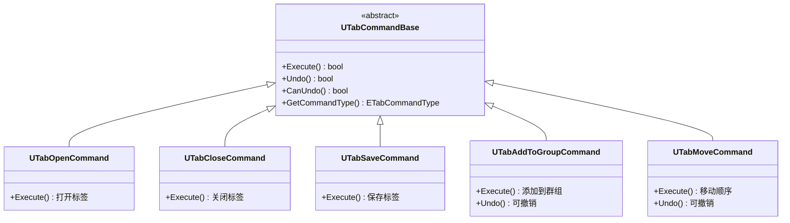
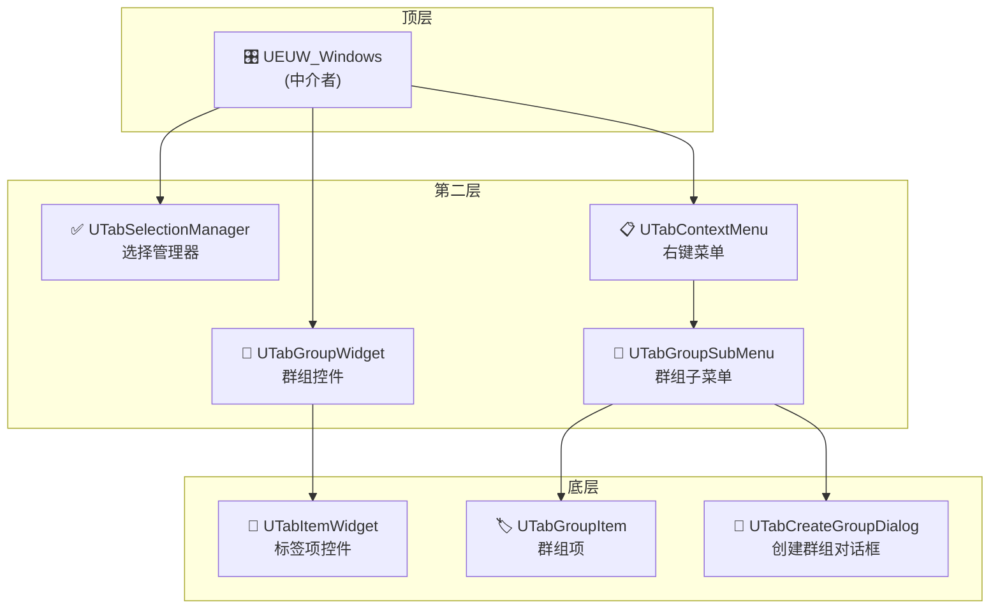
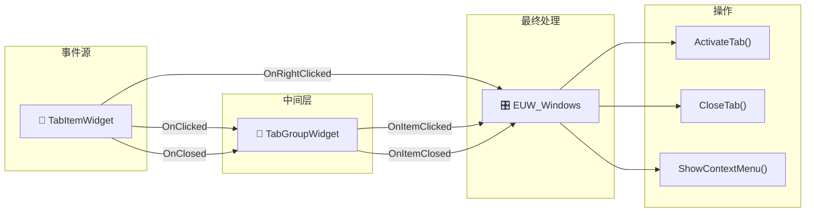
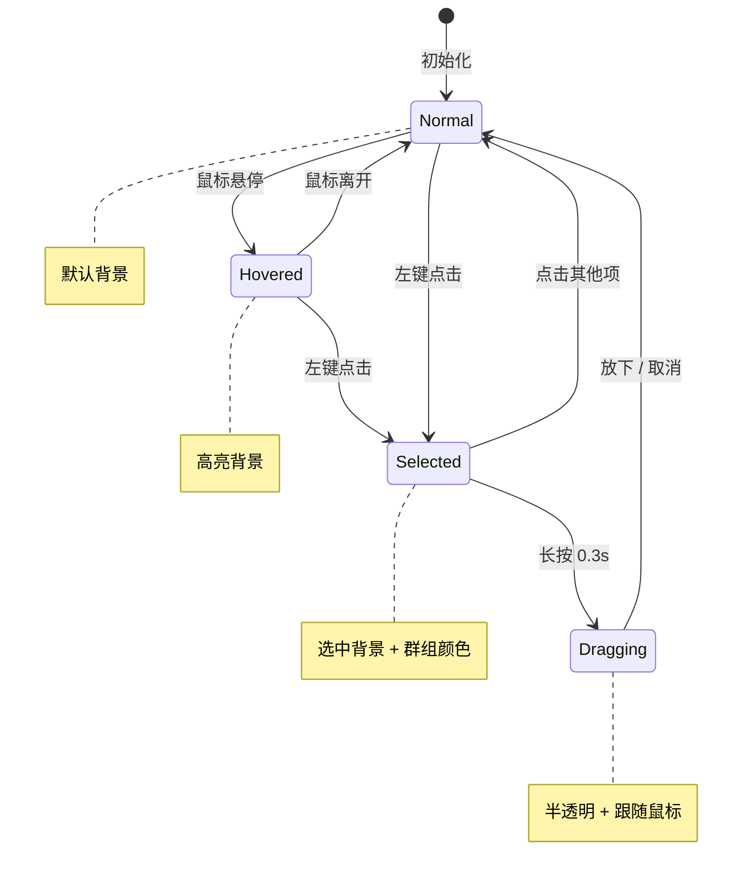
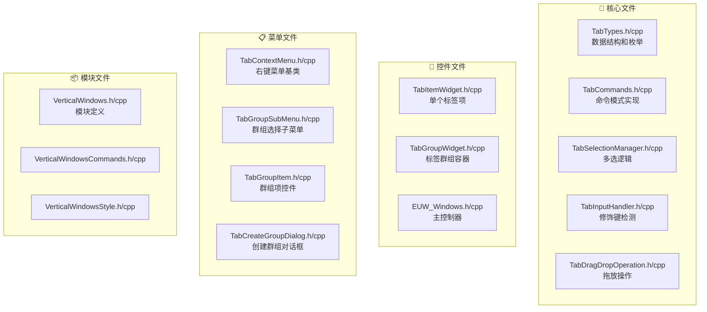
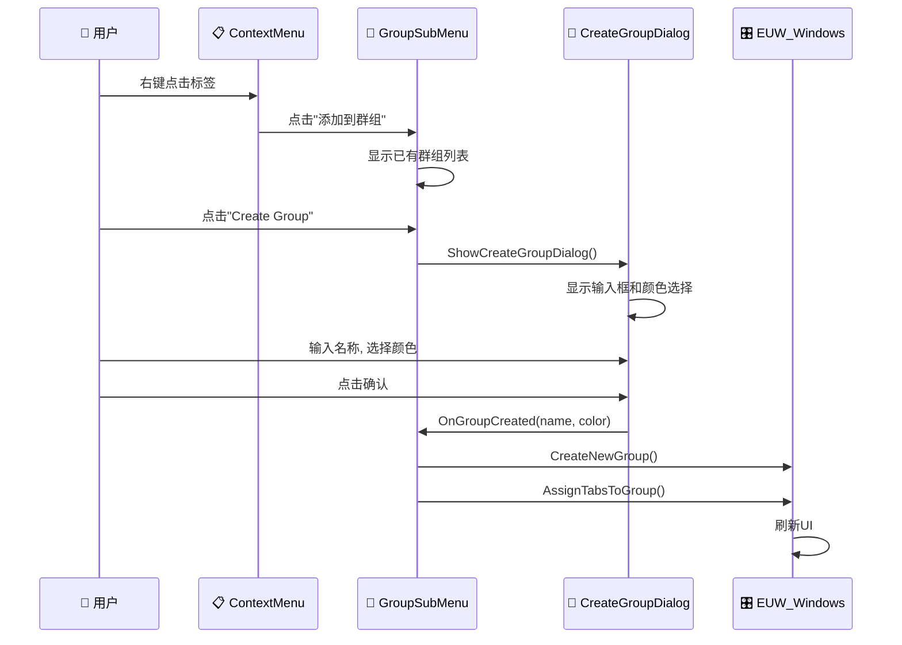
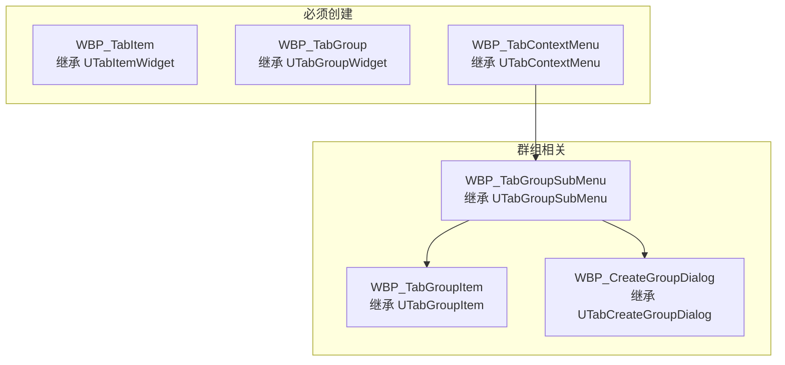

# VerticalWindows 插件 - 架构文档

## 概述

VerticalWindows 是一个 UE5 编辑器插件，提供垂直标签页管理器，用于管理已打开的编辑器资产。功能类似浏览器标签页管理，支持分组、多选、拖拽排序和右键菜单。

---

## 设计模式

### 1. 命令模式 (Command Pattern) - `TabCommands.h/cpp`

**目的**：将操作封装为对象，支持批量执行、撤销和解耦。



**优点**：
- 多选操作可作为单个命令执行
- 通过 `UTabCommandInvoker` 支持撤销/重做
- 新增操作无需修改现有代码

---

### 2. 中介者模式 (Mediator Pattern) - `EUW_Windows`

**目的**：作为中央协调者，管理组件间通信。



**职责**：
- 接收来自 Item/Group 的事件
- 协调选择状态
- 管理右键菜单生命周期
- 处理标签操作（打开、关闭、保存）

---

### 3. 观察者模式 (Observer Pattern) - 委托系统

**目的**：使用 UE 委托系统实现解耦的事件通知。



**关键委托**：
| 类 | 委托 | 用途 |
|---|------|------|
| `UTabItemWidget` | `OnClicked` | 左键点击通知 |
| `UTabItemWidget` | `OnRightClicked` | 右键点击（带位置） |
| `UTabItemWidget` | `OnDragStarted` | 拖拽开始 |
| `UTabGroupWidget` | `OnItemClicked` | 转发子项点击事件 |
| `UEUW_Windows` | `OnTabActivated` | 标签被打开 |
| `UEUW_Windows` | `OnContextMenuRequested` | 请求显示菜单 |

---

### 4. 状态模式 (State Pattern) - `ETabItemState`

**目的**：清晰管理标签项的视觉状态。



---

## 文件结构



### 文件列表

| 文件 | 说明 | 状态 |
|------|------|------|
| `TabTypes.h/cpp` | 数据结构和枚举 | ✅ |
| `TabCommands.h/cpp` | 命令模式实现 | ✅ |
| `TabSelectionManager.h/cpp` | 多选逻辑 | ✅ |
| `TabDragDropOperation.h/cpp` | 拖放操作 | ✅ |
| `TabInputHandler.h/cpp` | 修饰键检测 | ✅ |
| `TabItemWidget.h/cpp` | 单个标签项控件 | ✅ |
| `TabGroupWidget.h/cpp` | 标签群组容器 | ✅ |
| `EUW_Windows.h/cpp` | 主控制器（中介者） | ✅ |
| `TabContextMenu.h/cpp` | 右键菜单基类 | ✅ |
| `TabGroupSubMenu.h/cpp` | 群组选择子菜单 | ✅ |
| `TabGroupItem.h/cpp` | 群组项控件 | 🆕 |
| `TabCreateGroupDialog.h/cpp` | 创建群组对话框 | 🆕 |
| `VerticalWindows.h/cpp` | 模块定义 | ✅ |
| `VerticalWindowsCommands.h/cpp` | 命令定义 | ✅ |
| `VerticalWindowsStyle.h/cpp` | 样式定义 | ✅ |

---

## 类职责

### 核心类

| 类 | 职责 |
|---|------|
| `UEUW_Windows` | 主 EditorUtilityWidget，中介者，标签数据生成 |
| `UTabItemWidget` | 单个标签显示，点击/悬停/拖拽处理 |
| `UTabGroupWidget` | 群组容器，事件转发 |
| `UTabSelectionManager` | 多选状态，Shift/Ctrl 支持 |

### 命令类

| 类 | 操作 |
|---|------|
| `UTabOpenCommand` | 打开/激活标签 |
| `UTabCloseCommand` | 关闭标签 |
| `UTabSaveCommand` | 保存脏标签 |
| `UTabBrowseCommand` | 在内容浏览器中定位资产 |
| `UTabAddToGroupCommand` | 将标签分配到自定义群组（可撤销） |
| `UTabMoveCommand` | 重排标签顺序（可撤销） |
| `UTabCommandInvoker` | 执行命令，管理撤销历史 |

### UI 类

| 类 | 用途 |
|---|------|
| `UTabContextMenu` | 右键菜单（蓝图基类） |
| `UTabGroupSubMenu` | "添加到群组" 子菜单 |
| `UTabGroupItem` | 🆕 群组项控件（颜色图标+名称） |
| `UTabCreateGroupDialog` | 🆕 创建群组对话框（名称+颜色选择） |

### 工具类

| 类 | 用途 |
|---|------|
| `UTabInputHandler` | 修饰键状态（Shift/Ctrl/Alt） |
| `UTabInputFunctionLibrary` | 按键状态静态函数 |
| `UTabDragDropOperation` | 拖拽数据容器 |

---

## 事件流程

### 左键点击 → 打开标签

```
1. UTabItemWidget::NativeOnMouseButtonUp()
   ↓
2. UTabInputFunctionLibrary::IsShiftKeyDown() / IsCtrlKeyDown()
   ↓
3. UTabSelectionManager::HandleItemClick(Tab, bShift, bCtrl)
   ├── 如果按住 Shift: SelectRange()      // 范围选择
   ├── 如果按住 Ctrl: ToggleSelection()   // 切换选择
   └── 否则: SelectSingle()               // 单选
   ↓
4. UTabItemWidget::HandleItemClicked()
   ↓
5. UTabItemWidget::OnClicked.Broadcast()
   ↓
6. UTabGroupWidget::HandleChildItemClicked() [如果在群组内]
   ↓
7. UTabGroupWidget::OnItemClicked.Broadcast()
   ↓
8. UEUW_Windows::HandleGroupItemClicked()
   ↓
9. UEUW_Windows::ActivateTab()  // 打开资产编辑器
```

### 右键点击 → 显示菜单

```
1. UTabItemWidget::NativeOnMouseButtonDown(RightButton)
   ↓
2. UTabItemWidget::HandleRightClicked(ScreenPosition)
   ↓
3. UTabItemWidget::OnRightClicked.Broadcast()
   ↓
4. [事件冒泡到 UEUW_Windows]
   ↓
5. UEUW_Windows::HandleItemRightClicked()
   ├── 如果是多选且当前项被选中: 使用所有选中的标签
   └── 否则: 只使用当前点击的标签
   ↓
6. UEUW_Windows::ShowContextMenu(Tabs, Position)
   ↓
7. 创建 UTabContextMenu 控件
   ↓
8. UTabContextMenu::InitializeMenu()
   ↓
9. UTabContextMenu::ShowAtPosition()
```

### 长按 → 拖拽

```
1. UTabItemWidget::NativeOnMouseButtonDown(LeftButton)
   └── bMouseDownForDrag = true
   └── MouseDownTime = 0

2. UTabItemWidget::NativeTick() [每帧调用]
   └── MouseDownTime += DeltaTime
   └── 如果 MouseDownTime >= DragHoldTime (0.3秒):
       └── 检查鼠标移动距离
       └── 如果 < 10像素: StartDragOperation()

3. UTabItemWidget::StartDragOperation()
   └── bIsDragging = true
   └── SetItemState(Dragging)
   └── OnDragStarted.Broadcast()
   └── 创建 UTabDragDropOperation
```

### Shift 多选

```
1. 用户点击标签 A → SelectSingle(A), 锚点 = A
   ↓
2. 用户 Shift+点击 标签 D
   ↓
3. SelectionManager::HandleItemClick(D, bShift=true, bCtrl=false)
   ↓
4. SelectionManager::SelectRange(D)
   └── 查找索引: 锚点=0, 目标=3
   └── 选择索引 0 到 3 的所有标签
   ↓
5. UpdateAllWidgetVisuals()
   └── 遍历已注册的控件
   └── 根据 SelectedTabIds 调用 SetIsSelected()
```

---

### 创建群组流程



---

## 数据结构

### FEditorTabInfo（编辑器标签信息）

```cpp
struct FEditorTabInfo
{
    FString TabId;           // 唯一标识符（资产路径）
    FString DisplayName;     // 显示名称
    FString AssetPath;       // 完整资产路径
    FString AssetType;       // 类型分类
    FString AssetClassName;  // UClass 名称
    bool bIsDirty;           // 是否有未保存的更改
    bool bIsActive;          // 是否当前聚焦
    FString GroupId;         // 当前群组
    FLinearColor GroupColor; // 群组颜色
    FSlateBrush IconBrush;   // 资产图标
    int32 DisplayOrder;      // 排序顺序
    FString CustomGroupId;   // 用户自定义群组
};
```

### FTabGroupInfo（标签群组信息）

```cpp
struct FTabGroupInfo
{
    FString GroupId;         // 群组ID
    FString GroupName;       // 群组名称
    FLinearColor Color;      // 群组颜色
    bool bExpanded;          // 是否展开
    bool bIsCustomGroup;     // 是否用户创建的群组
    TArray<FEditorTabInfo> Tabs;  // 群组内的标签
};
```

### FCustomTabGroup（自定义群组）

```cpp
struct FCustomTabGroup
{
    FString GroupId;         // 群组ID
    FString GroupName;       // 群组名称
    FLinearColor Color;      // 群组颜色
    TArray<FString> TabIds;  // 群组内的标签ID列表
};
```

---

## 蓝图集成

### 需要创建的蓝图类



### WBP_TabGroupItem 控件结构

```
[Canvas Panel]
└── [Button] RootButton
    └── [Horizontal Box]
        ├── [Image] ColorIcon          // 群组颜色方块
        └── [Text] GroupNameText       // 群组名称
```

### WBP_CreateGroupDialog 控件结构

```
[Canvas Panel]
└── [Border] 背景
    └── [Vertical Box]
        ├── [Text] "Create Group" 标题
        ├── [Editable Text Box] NameInputBox
        ├── [Horizontal Box] 颜色选择
        │   ├── [Button] ColorBtn_Red
        │   ├── [Button] ColorBtn_Orange
        │   ├── [Button] ColorBtn_Yellow
        │   ├── [Button] ColorBtn_Green
        │   ├── [Button] ColorBtn_Cyan
        │   ├── [Button] ColorBtn_Blue
        │   ├── [Button] ColorBtn_Purple
        │   └── [Button] ColorBtn_Pink
        ├── [Image] ColorPreview       // 当前颜色预览
        └── [Horizontal Box] 按钮区
            ├── [Button] CancelButton
            └── [Button] ConfirmButton
```

### 在 EUW_Windows 蓝图中设置

| 属性 | 值 |
|------|-----|
| `TabItemClass` | WBP_TabItem |
| `TabGroupClass` | WBP_TabGroup |
| `ContextMenuClass` | WBP_TabContextMenu |
| `GroupSubMenuClass` | WBP_TabGroupSubMenu |

### 在 WBP_TabGroupSubMenu 中设置

| 属性 | 值 |
|------|-----|
| `GroupItemClass` | WBP_TabGroupItem |
| `CreateGroupDialogClass` | WBP_CreateGroupDialog |

### 关键蓝图事件

| 事件 | 触发时机 |
|------|----------|
| `OnTabsChanged` | 标签列表更新时 |
| `OnTabActivated` | 标签被打开时 |
| `OnContextMenuRequested` | 检测到右键点击时 |
| `OnSelectionChanged` | 选择状态改变时 |

---

## 修饰键检测

直接使用 Slate 应用程序（在编辑器上下文中有效）：

```cpp
// TabInputHandler.cpp
bool UTabInputFunctionLibrary::IsShiftKeyDown()
{
    if (FSlateApplication::IsInitialized())
    {
        return FSlateApplication::Get().GetModifierKeys().IsShiftDown();
    }
    return false;
}
```

**为什么不使用 Enhanced Input System**：
1. 编辑器控件没有 PlayerController
2. Slate 可直接访问修饰键状态
3. 在编辑器上下文中更可靠

---

## 扩展点

### 添加新命令

1. 创建继承 `UTabCommandBase` 的新类
2. 实现 `Execute()`，可选实现 `Undo()`
3. 添加工厂方法 `Create()`
4. 在 `ETabCommandType` 枚举中添加新类型

### 添加新菜单项

1. 在 `UTabContextMenu::BuildMenuItems()` 中添加新的 `FTabMenuItemData`
2. 在 `ExecuteMenuAction()` 中处理新的 action ID
3. 实现操作方法（如 `MenuAction_NewFeature()`）

### 自定义群组操作

```cpp
// 创建群组
Windows->CreateCustomGroup("我的群组");

// 分配标签到群组
Windows->AssignTabsToGroup(SelectedTabs, "我的群组");

// 删除群组
Windows->DeleteCustomGroup("我的群组");
```

---

## 性能考虑

1. **智能刷新**：`HasTabsChanged()` 在重建 UI 前比较标签状态
2. **延迟创建控件**：控件在 `RebuildUI()` 时按需创建
3. **弱指针**：使用 `TWeakObjectPtr` 避免循环依赖
4. **定时器刷新**：1.0秒间隔防止过度轮询

---

## 已知限制

1. 拖拽排序仅影响视觉（不会持久化编辑器标签顺序）
2. 自定义群组不会在会话间保存（可添加配置保存）
3. 不支持多选拖拽（仅支持单项拖拽）
4. 暂无键盘快捷键（可添加 Ctrl+A 全选）

---

## 未来改进

- [ ] 将自定义群组持久化到配置文件
- [ ] 键盘导航（方向键、回车打开）
- [ ] Ctrl+A 全选
- [ ] 搜索/过滤标签
- [ ] 标签固定功能
- [ ] 拖拽到外部窗口（分屏视图）

---

## 快速参考

### 打开标签
```cpp
Windows->ActivateTab(TabId);
```

### 关闭标签
```cpp
Windows->CloseTab(TabId);
```

### 获取选中的标签
```cpp
TArray<FEditorTabInfo> Selected = Windows->GetSelectedTabs();
```

### 显示右键菜单
```cpp
Windows->ShowContextMenu(Tabs, ScreenPosition);
```

### 检查修饰键
```cpp
bool bShift = UTabInputFunctionLibrary::IsShiftKeyDown();
bool bCtrl = UTabInputFunctionLibrary::IsCtrlKeyDown();
```
