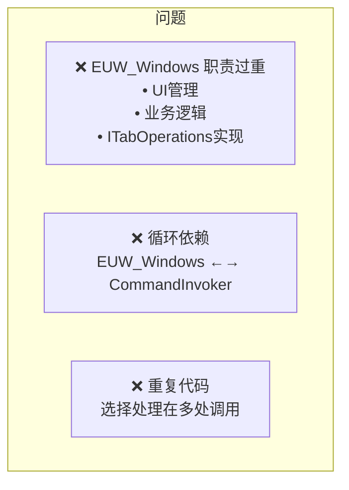
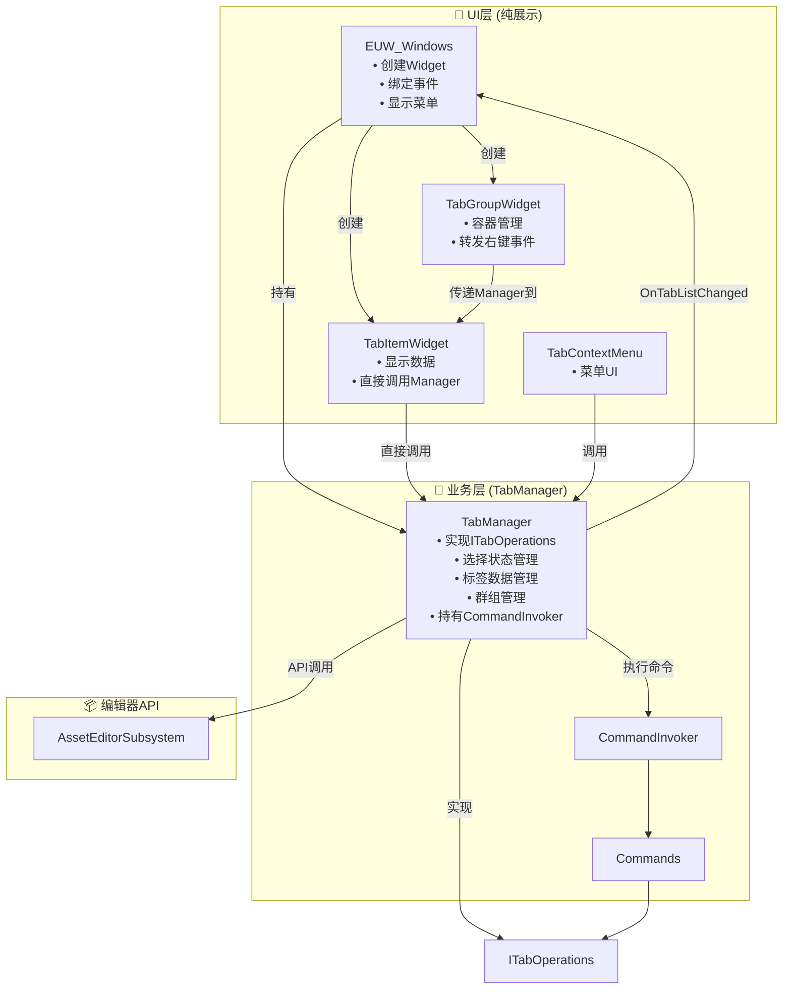

# VerticalWindows 插件 - 重构后架构文档

## 概述

VerticalWindows 是一个 UE5 编辑器插件，提供垂直标签页管理器。

**重构目标**：将 `EUW_Windows` 变为纯 UI 层，所有业务逻辑集中到 `TabManager`。

---

## 重构前后对比

### 重构前问题



### 重构后架构



---

## 核心改动

### 1. TabManager（新增）

**职责**：
- 实现 `ITabOperations` 接口（所有标签操作的真正执行者）
- 管理选择状态（原 `TabSelectionManager` 的功能）
- 管理标签数据（刷新、缓存）
- 管理自定义群组
- 持有 `CommandInvoker`

```cpp
// 旧代码：操作分散在多处
EUW_Windows->ActivateTab(TabId);  // EUW_Windows 实现 ITabOperations
SelectionManager->HandleItemClick(...);  // 选择管理器单独
CommandInvoker->OpenTab(TabInfo);  // 命令调用器单独

// 新代码：所有操作通过 TabManager
TabManager->OpenTab(TabInfo);      // 包含选择处理 + 命令执行
TabManager->HandleItemClick(...);  // 统一的选择处理
```

### 2. EUW_Windows（简化）

**旧职责**：
- ❌ 实现 `ITabOperations`
- ❌ 管理选择状态
- ❌ 处理业务逻辑
- ✅ UI 容器管理

**新职责**：
- ✅ 创建/销毁 Widget
- ✅ 绑定事件到 Manager
- ✅ 显示右键菜单
- ✅ 提供便捷访问方法（委托到 Manager）

```cpp
// 旧代码：EUW_Windows 什么都做
class UEUW_Windows : public UEditorUtilityWidget, public ITabOperations {
    virtual bool ActivateTab(const FString& TabId) override;
    UTabSelectionManager* SelectionManager;
    UTabCommandInvoker* CommandInvoker;
    // ... 大量业务逻辑
};

// 新代码：EUW_Windows 只做 UI
class UEUW_Windows : public UEditorUtilityWidget {
    UTabManager* TabManager;  // 所有操作委托给 Manager
    void RebuildUI();
    void ShowContextMenu(...);
};
```

### 3. TabItemWidget（简化）

**旧方式**：
```cpp
void UTabItemWidget::HandleItemClicked() {
    // 选择管理器处理
    if (SelectionManager.IsValid()) {
        SelectionManager->HandleItemClick(TabData, bShift, bCtrl);
    }
    // 广播事件
    OnClicked.Broadcast(TabData);  // 事件传递到 EUW_Windows
}

// EUW_Windows::HandleItemClicked 再次调用
void UEUW_Windows::HandleItemClicked(const FEditorTabInfo& TabInfo) {
    if (SelectionManager) {
        SelectionManager->HandleItemClick(TabData, bShift, bCtrl);  // 重复！
    }
    if (CommandInvoker) {
        CommandInvoker->OpenTab(TabInfo);
    }
}
```

**新方式**：
```cpp
void UTabItemWidget::HandleItemClicked() {
    if (!TabManager.IsValid()) return;
    
    // 1. 处理选择
    TabManager->HandleItemClick(TabData, bShift, bCtrl);
    
    // 2. 打开标签
    TabManager->OpenTab(TabData);
    
    // 没有事件广播，没有重复调用
}
```

---

## 事件流程对比

### 点击标签打开

**旧流程**（问题：重复调用选择处理）：
```
1. TabItemWidget::HandleItemClicked()
   ├── SelectionManager->HandleItemClick()  ← 第一次
   └── OnClicked.Broadcast()
         ↓
2. EUW_Windows::HandleItemClicked()
   ├── SelectionManager->HandleItemClick()  ← 重复！
   └── CommandInvoker->OpenTab()
         ↓
3. OpenCommand::Execute()
   └── OperationsRef->ActivateTab()
         ↓
4. EUW_Windows::ActivateTab()  ← 循环依赖
```

**新流程**（简洁直接）：
```
1. TabItemWidget::HandleItemClicked()
   └── TabManager->HandleItemClick()  ← 一次选择处理
   └── TabManager->OpenTab()
         ↓
2. OpenCommand::Execute()
   └── OperationsRef->ActivateTab()
         ↓
3. TabManager::ActivateTab()  ← Manager 实现接口
```

---

## 文件变更清单

| 文件 | 状态 | 说明 |
|------|------|------|
| `TabManager.h/cpp` | **新增** | 核心业务管理器 |
| `EUW_Windows.h/cpp` | **大改** | 移除业务逻辑，变为纯 UI |
| `TabItemWidget.h/cpp` | **修改** | 直接调用 Manager |
| `TabGroupWidget.h/cpp` | **修改** | 传递 Manager 引用 |
| `TabContextMenu.h/cpp` | **修改** | 使用 Manager 而非 Windows |
| `TabSelectionManager.h/cpp` | **删除** | 功能合并到 Manager |

---

## 关键代码片段

### TabManager 初始化

```cpp
// EUW_Windows::NativeConstruct()
void UEUW_Windows::NativeConstruct()
{
    Super::NativeConstruct();
    
    // 创建 Manager
    TabManager = NewObject<UTabManager>(this);
    TabManager->Initialize();
    
    // 绑定事件
    TabManager->OnTabListChanged.AddDynamic(this, &UEUW_Windows::RebuildUI);
    
    // 启动自动刷新
    TabManager->StartAutoRefresh(1.0f);
}
```

### TabItemWidget 设置 Manager

```cpp
// EUW_Windows::BuildFlatList()
for (const FEditorTabInfo& Tab : AllTabs)
{
    UTabItemWidget* TabWidget = CreateWidget<UTabItemWidget>(this, TabItemClass);
    if (TabWidget)
    {
        TabWidget->SetTabManager(TabManager);  // 直接设置 Manager
        TabWidget->SetTabData(Tab);
        // 只绑定需要 UI 处理的事件（右键菜单）
        TabWidget->OnRightClicked.AddDynamic(this, &UEUW_Windows::HandleItemRightClicked);
        ItemContainer->AddChildToVerticalBox(TabWidget);
    }
}
```

### TabItemWidget 直接调用 Manager

```cpp
void UTabItemWidget::HandleItemClicked()
{
    if (!TabManager.IsValid()) return;
    
    // 处理选择
    bool bShift = UTabInputFunctionLibrary::IsShiftKeyDown();
    bool bCtrl = UTabInputFunctionLibrary::IsCtrlKeyDown();
    TabManager->HandleItemClick(TabData, bShift, bCtrl);
    
    // 打开标签
    TabManager->OpenTab(TabData);
}

void UTabItemWidget::HandleCloseClicked()
{
    if (!TabManager.IsValid()) return;
    
    // 多选时关闭所有选中的
    if (TabManager->IsMultiSelection() && TabManager->IsSelected(TabData))
    {
        TabManager->CloseSelectedTabs();
    }
    else
    {
        TabManager->CloseTabByInfo(TabData);
    }
}
```

---

## 迁移指南

### 蓝图更新

1. **EUW_Windows 蓝图**：
   - 移除对 `SelectionManager` 和 `CommandInvoker` 的直接引用
   - 使用 `TabManager` 属性访问所有功能

2. **TabItemWidget 蓝图**：
   - 移除 `SelectionManager` 和 `CommandInvoker` 引用
   - 确保 `TabManager` 已设置

### C++ 代码更新

```cpp
// 旧代码
Windows->SelectionManager->GetSelectedTabs();
Windows->CommandInvoker->CloseTabs(Tabs);

// 新代码
Windows->TabManager->GetSelectedTabs();
Windows->TabManager->CloseTabs(Tabs);
```

---

## 设计优势

1. **单一职责**：每个类职责明确
2. **无循环依赖**：`Manager` 实现接口，`Commands` 依赖接口
3. **易于测试**：`TabManager` 可独立测试
4. **代码简洁**：移除重复的事件转发
5. **扩展性好**：新功能只需修改 `TabManager`
